```{r setup, include=FALSE}
knitr::opts_chunk$set(echo = TRUE)
xfun::pkg_load2(c("htmltools", "mime"))
```

# Elementary School Division

<center>
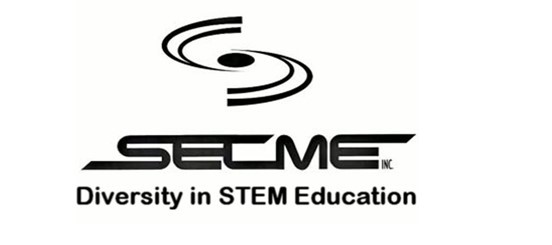
</center>

To view the competition guidelines in a PDF click to
```{r echo=FALSE}
xfun::embed_file("/Users/kristadulany/Documents/GitHub/SECME/SECME Guidlines_22-23/SECME Guidelines 22-23_EL.pdf")
```

# Letter to our Competition Hosts

Dear SECME Educators and Competition Hosts:

The SECME National Office is excited to welcome you to the 2022-2023 SECME Competition year. This year’s competition theme is based on “School or ISL mascot or school motto.” This packet contains information for the SECME National Student Engineering Design Competition Finals, referred to as “Guidelines.” Due to the continuation of the public health crisis, the 2023 Competition will be virtual, and the content in this year’s Guidelines reflects a virtual National Competition.

However, we are working with our schools, school districts, and member universities to ascertain the feasibility of a live, in-person National Competition. The SECME National Office will announce the determination on or before Monday, January 30, 2023. An addendum to these Guidelines will be prepared, disseminated, and posted on our website if the competition moves to a live, in-person format.

To our SECME competition hosts, in addition to hosting your SECME competition, in years past, many of you have provided technical assistance to schools and districts by way of SECME workshops for teachers to learn basic and necessary SECME competition skills to assist SECME students. The ability to provide these services continues to reside in this evolving new atmosphere. The SECME National Office is preparing to support by developing complementary competition training videos for all 2022-2023 registered schools.

To make this year’s competition fun and challenging, we added new engineering and artistic twists and turns to stir our future scientists’, engineers’, technologists,’ and mathematicians’ minds. Activities, deadlines, and SECME competitions at the local, state, district, and regional levels are at the discretion of the SECME Member University or Competition Host. We encourage participation at all levels and divisions (elementary, middle, and high school).

Thank you for your partnership and commitment to equity and excellence in STEM education. Have a wonderful and safe school year!

Sincerely,
Dr. Julaunica Tigner
Educational Outreach Manager

We welcome any corrections or any suggestions for improvement to our Guidelines. The feedback and comments we receive via email or telephone calls have supported the preparation of our annual guidelines. To provide feedback, please email julaunicatigner@ufl.edu


# SECME Competition Information

<center>
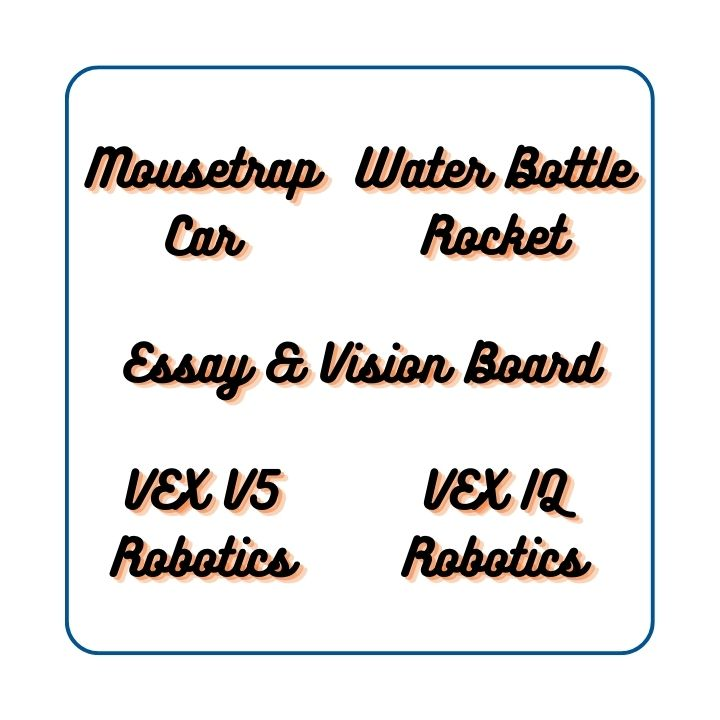{width=50%}
</center>

All SECME competitions:

* Are for individual SECME students and SECME student teams

*	All SECME competition hosts should communicate with their participating schools and ISLs about their local arrangements

*	Student teams may have one to three students on the team

SECME engineering design competitions are intended to challenge SECME student participants and develop essential skills for their futures as STEM professionals. Construction of vehicles, technical designs, technical and written reports, patch designs, PowerPoint presentations, essays, vision boards, and posters should be solely the work of the SECME student participants. Plagiarism is prohibited. Remember that **PLAGIARISM** is taking someone else’s work or ideas and passing them off as one’s own or using your old work and passing it off as new (self-plagiarism).


## SECME Important Deadlines

The SECME National Office will publish announcements, changes, and updates on the SECME Website under the News tab. Additional details on the electronic submissions process are in the Reporting Checklist. Terms used throughout these Guidelines are on the Definitions and Explanations Page.

**Monday, January 9, 2023** – Competing *schools* must register with the SECME National Office.

**Monday, January 30, 2023** – Competing *students* must register with the SECME National Office.

**Friday, March 3rd, 2023** – Coordinators need to complete the SECME participation survey

**Monday, March 13, 2023*** – *Registration Opens* Registration opens for all qualifying and non-qualifying competitions. All competition hosts must REGISTER their SECME local, district, state, and regional first-place winners.

*All* required competition documents and videos are due to the SECME National Office.

*There is a deadline extension for the Texas Region

**Monday, April 3, 2023** – *Registration Closes*

**Monday, April 10, 2023**

***New!*** SECME District and Regional Hosts must upload all required competition documents and videos for their first-place winners. The Reporting Checklist section contains a complete listing of required documents. Click to view the [Reporting Checklist] section.

SECME Student Surveys are due for **ALL SECME students**. It is **REQUIRED** for all students. The links below are also available on our website at

The links below are also available on our website at www.secme.org.

[Grades Pre-K-2](https://docs.google.com/forms/d/e/1FAIpQLSdi2zdJJMA-rxnXYLa5RA6A4w9WYveUo7jSx-T2QYGO9nJ-tQ/viewform)

[Grades 3-5](https://docs.google.com/forms/d/e/1FAIpQLSf_ifcTiNtmyKXqQO_rdhDbz1qd4jLu0iGHP3MHr3lxbiuZ8Q/viewform)

[Grades 6-8](https://docs.google.com/forms/d/e/1FAIpQLSdMQzwUZuPFnM5otwzE780fzZrpF0Kq1-SUwzaL5NCWmmmDBw/viewform)

[Grades 9-12](https://docs.google.com/forms/d/e/1FAIpQLSel-eW9BCVAyOYXJpYIlMcbzZ__4tkSlC6_v_ngZbu2XzLizw/viewform)

**Monday, May 8, 2023** – Notification of Winners. SECME will post a listing of All winners on their website.


```{r echo=FALSE}
xfun::embed_file("/Users/kristadulany/Documents/GitHub/SECME/SECME Guidlines_22-23/docs/SECME Important Deadlines.pdf")
```
 
 
 
## General Competition Information

Please read the entirety of the 2022-2023 SECME National Student Engineering Design Competition Guidelines. Any alterations to these Guidelines are prohibited. If you are a SECME competition host with local SECME competition guidelines, please keep the contents of the National Competition Guidelines separate from your local guidelines.  

### Collaboration and Consent

To foster collaboration and a knowledge-sharing STEM community, all materials submitted to SECME will become the property of SECME and may be shared via the SECME website, marketing documents, presentations, etc. Materials include, but are not limited to, written and technical reports, engineering notebooks, pictures, technical drawings, etc. We have included a parent/guardian consent form to use said documents. The SECME Coordinator will provide this document to the parent/guardian of each 1st place winner of local, district, state, and regional winner. Click to download the [SECME Consent Form - Photo/Video]

### New and Returning Features

*	A standard tennis ball will be the passenger for the Mousetrap Car (MTC)

*	The MTC and Water Bottle Rocket (WBR) build has a $2.50 maximum budget – All divisions

*	WBR calculation exercises submission in written and technical reports – All divisions

*	Scoring adjustments for in-person and virtual competition methods

*	**Competition hosts will register all first-place winning SECME students and student teams from their local, district, state, and regional competitions**

*	SECME Coordinators will upload all required documents see [Reporting Checklist]

*	An Art of Engineering Video Presentation (AOE) is needed – All Divisions, Following Team Competitions: MTC, WBR, VEX IQ, and VEX V5 

*	Technical drawing – competition teams can include an AutoCAD drawing with their hand to draw a technical drawing of the MTC and WBR.

*	Patch Design theme aligned with SECME theme – “School or ISL mascot or school motto.”

*	A video demonstrating the competition vehicle (MTC, WBR, VEX IQ, and VEX V5) in motion

*	Video submission for Essay/Vision Board (optional) – middle and high school division

SECME competitions are a fantastic way for teachers to reinforce science, technology, engineering, and mathematics skills with exciting, engaging hands-on activities while challenging students to persevere and excel. SECME student competitions expose students to real-world applications in science, technology, engineering, and mathematics while generating interest and excitement about college and careers in **STEM**.


### Register Winning Students and Teams

All 1st place winners at their local, district, state, or regional competition advance to SECME National Competition Finals. The competition hosts must report all winners to the SECME National Office using an electronic registration. Registration opens **Monday, March 13, 2023**, and closes **Monday, April 3, 2023**. Each student on a team is required to have SECME Registration Information submitted on their behalf. Complete the [SECME Registration Information]

## SECME Registration Information

Below is the information needed to register 1st place winners for qualifying and non-qualifying competitions. Registration opens **Monday, March 13, 2023**, and closes on **Monday, April 3, 2023**. A registration link will also be sent with instructions to complete registration.

```{r echo=FALSE}
xfun::embed_file("/Users/kristadulany/Documents/GitHub/SECME/SECME Guidlines_22-23/docs/SECME Registration Information.pdf")
```
<center>
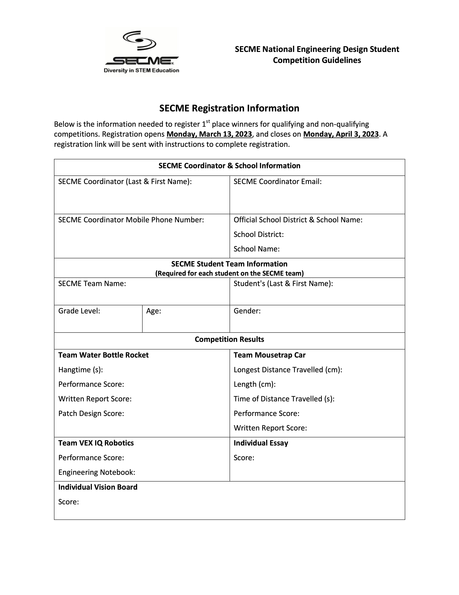{width=100%}
</center>

## SECME Eligibility Criteria 

**PLEASE READ CAREFULLY**

SECME Member Universities, Program Directors, and Coordinators are asked to distribute or reference these Guidelines to all educators, parents, business & industry partners, and graduate and undergraduate students who prepare students for this year’s competitions or serve as mentors or judges. They must fully understand the Guidelines and judging criteria for each competition.

1.	All entries are expected to be neat, original, and *only completed by the SECME student.*

2.	Elementary, Middle, and High School SECME students will compete with other SECME students in their respective grade bands.

3.	As identified in these guidelines, first-place SECME local, district, state, or regional winning students or student teams advance to the 2022-2023 SECME National Student Competition Finals.


### Required Competition Information

Registration of your SECME program (school or ISL) and student data is an annual requirement to participate in SECME. Additionally, SECME Coordinators and students are to submit annual reports and surveys. SECME Coordinators **must** submit the following for your students to compete in SECME Competitions for the 2022-2023 school year:

A.	All Competing schools/ISLs must register with the SECME National Office by **Monday, January 9, 2023**.

B.	All students participating in SECME National Student Competition Finals must be registered and updated in the SECME National Database System by **Monday, January 30, 2023**.


**Students NOT REGISTERED will be ineligible to compete in SECME National Student Competition Finals.**

A.	SECME Coordinators, please follow your local, district, state, or regional competition host’s procedures and dates for submitting all SECME-required competition documents, forms, and reports.

B.	Student Surveys. **All students participating in the SECME National Student Competition Finals must complete the electronic Student Survey no later than Monday, April 10, 2023**. Students will be ineligible to compete if they have not completed the SECME Student Survey.


### Register Students and Teams

All member universities, districts, and ISLs will receive an invitation to register their first-place winning students and student teams. Suppose Robotics and Poster Competitions are not part of your local, district, state, or regional competition. In that case, Coordinators will have the opportunity to register their students competing in either of these competitions as these are “non-qualifying” competitions. 

Registration opens **Monday, March 13, 2023, and closes Monday, April 3, 2023**. Hard copy registrations and emails will not be accepted. If you have problems with the electronic registration, please contact the SECME National Office for assistance.

### Coordinator Information

Upon notification of local, district, state, or regional winners, SECME Coordinators will be sent a link to upload all required competition documents, including the AOE video presentation, forms, reports, and photo/video permission slips/consent forms. Necessary documents are due on or before **Monday, April 10, 2023**.

Required competition documents not uploaded will receive a zero-point score for the designated category. The [Reporting Checklist] contains all of the reporting details. Upload competition documents electronically; email submissions are not accepted. Please contact the SECME National Office for assistance if you have problems with the electronic upload process.

# Competition Guidelines

## Mouse Trap Car (MTC)

<center>
{width=75%}
</center>

### All Divisions - Construction and Operation

Any team not adhering to the construction and operation guidelines will not be eligible to place.

#### Construction and Design Requirements

1.	**A standard mousetrap** with dimensions of: length of 9.8 cm, width of 4.5 cm, and weight about 25 grams, **MUST** be used to construct the mousetrap car. **NO PHYSICAL, CHEMICAL, MECHANICAL, OR THERMAL TREATMENT OF THE MOUSETRAP IS PERMITTED.**

2.	Standard mousetraps with **ONE SPRING are ALLOWED**.

3.	The components of the mousetrap are a **wooden base. The other parts are mounted on the base: spring, bail, locking lever, and bait hook**. See [Standard Mousetrap Diagram].

4.	The mousetrap’s “single” spring must be the sole source of power. You may **NOT** provide extra power to your car by using rubber bands, CO2 boosters, rollback wheels/gears, or other agents or elements.

5.	In the car’s design and construction, the original mousetrap spring and wood base **MUST** remain intact. These two components may **NOT** be cut or altered in any way — mechanically, physically, chemically, or thermally. Only the locking lever and bait holder (and the staples that hold them on) may be removed from the base if desired. Teams may straighten the bail from its original bent configuration. It must remain a part of the completed car. 

6.	The spring must be visible and accessible to the judges for inspection.

7.	The mousetrap car must have a **minimum of three wheels** and can be as long or short as desired if it meets **requirement #5** above.

8.	Mousetrap cars are tested on a smooth flat surface. Distance will be measured from the front of the front wheel(s) at the starting point to the front of the front wheel(s) at the stopping point of travel, utilizing a straight line to connect the two points *(total displacement, not the path traveled)*.

9.	There will be two runs for each car. The best run is used for the final scoring of the mousetrap car’s performance. 

10.	The mousetrap car should reflect this year’s efforts by your SECME student teams. During SECME Competition, **ONLY** the SECME students on the same SECME student team can adjust or make alterations to their mousetrap car.

    a.	If anyone other than the student teams is seen adjusting the mousetrap car, or         there is evidence, the team will be disqualified and unable to compete.
    
    b.	This includes but is not limited to SECME Coordinators/Coaches, Parents, etc.

11.	Evidence of plagiarism or re-submission of previous years’ reports will result in a zero score.

The design requirement of this year’s SECME engineering design competition is for the SECME student team to design and build a vehicle solely powered by a single spring mousetrap with a maximum budget of $2.50 that can swiftly transport (or carry) a tennis ball with approximate weights and diameters of 57.7 grams and 66.9 mm (.64 inches).

**The mousetrap car**

*	Needs to carry a tennis ball with a weight of approximately 57.7 grams and a diameter of about 66.9 mm (.64 inches)

*	May NOT have glue, tape, or anything to affix the tennis ball to the mousetrap car

*	May NOT wedge the tennis ball between the bait hook and the spring

*	Should be designed to allow for the purposeful removal of the tennis ball with minimal effort so that the Judge can examine it

*	Should transport the tennis ball (without losing it for the entire run)

*	Should not exceed a budget of $2.50 in building materials (maximum budget)

Original receipts for all materials purchased must be included* (scanned) AND recorded on the SECME Mousetrap Car Material List. 
* *If receipts are unavailable for new (not recycled) items, a link to the purchase website is sufficient to confirm the item cost.*

*	Do NOT include the cost of the basic mousetrap in your materials list

*	If using recycled materials, documentation must show how these items were obtained

*	Recycled materials are not included in the $2.50 maximum budget

**The tennis ball must remain in the mousetrap vehicle for the entire run of the mousetrap car to receive a qualifying score. A run is disqualified if the tennis ball falls out of the car.** If the tennis ball is dislodged due to a collision with an obstacle, the run is not disqualified. The run distance is measured to the point of collision - the front of the front wheel(s) at the starting point to the front of the front wheel(s) at the stopping point or the point of collision.

**A standard-size tennis ball with a diameter of 66.9 mm (.64”) and 40 g will be given to the SECME student teams on the day of competition before their run at the SECME National Student Competition Finals.**

~The Mousetrap Car Materials List is required for the Technical Report Appendix for middle/high school teams and the Written Report for elementary school teams. If the Materials List is NOT submitted, the Cost (C) for the team’s score is double the highest cost (C~H~) in the competition formula.

#### Measurement of L, the Mouse Car’s Longest Dimension
The length L is the longest dimension in the x, y, or z-axis. In other words, it could be the length, width, or height of the completed mousetrap car, which is the longest dimension.

<center>
{width=75%}
</center>

The mousetrap car’s **length L is the longest dimension in the car’s x, y, or z-axis** while the car is resting with the spring unwound. In other words, it could be the length, width, or height of the completed mousetrap car, which is the longest dimension. If the bail has been straightened and protrudes past the front or rear of the car, the measurement is taken from the end of the bail to the other end of the car. 
**L (for this example) = 16.4 cm**

#### Standard Mousetrap Diagram

<center>
{width=75%}
</center>

$\color{red}{\text{NOTE: The red parts may be removed from the car.}}$

### Elementary School Division - Construction and Operation

The MTC Engineering Design Competition, Elementary School Division requires participation in these two areas:

1.	Performance Run of the Mousetrap Car
2.	Written Report on Mousetrap Car

#### In-Person Event - Calculation of Mousetrap Car Score

The performance score for the Mousetrap car run is calculated using the following equation:

<center>
$P =\frac{D}{L} × \frac{D}{T} × \frac{C_H}{C}$
</center>

Where:
D is the distance the mousetrap car travels measured in centimeters (cm).

L is the longest length of the completed mousetrap car from any orientation on the x, y, and z-axis measured in centimeters (cm).

T is time measured from when the mousetrap car is released until the car has stopped, measured in seconds (s). 

C^+^ is the cost of the construction of the completed mousetrap car (based on the team’s MTC Materials List).*

C~H~ is a constant 2.5 (the highest possible cost). Therefore, C~H~=$2.50 in the equation.

P is the mousetrap car performance run score.

<center>
$F = \frac{P}{P_H} ×100%$
</center>

where:

P~H~ is the highest performance mousetrap car score on the day of the SECME Competition. 

F is the final performance score to be combined with the score from the Written Report.

Distance is measured from the front of the front wheel(s) at the starting point to the front of the front wheel(s) at the stopping point of travel, utilizing a straight line to connect the two points.

<mark> The Mousetrap Car **MUST travel a MINIMUM distance of 2 m (200 cm)** to qualify for the competition. </mark>

Suppose the mousetrap car stops due to hitting an object or wall. The distance is measured from the starting point to the point of impact.

<small> *If the MTC Materials List is NOT submitted, the Cost (C) for the team’s score is calculated as double the highest cost (C~H~) in the competition formula.*</small>

<small> *If the value of C is $0.00 (meaning that except for the mousetrap, your car is built entirely with recycled materials), then use $0.01 (one penny) for the value of C. Therefore, C=0.01 in the equation.*</small>


##### Example Calculation

<center>
$C=0.01$ 

$C_H=2.50$ 

C, C~H~ are in USD ($) amounts

$D=950 cm$ 

$T=9.50 s$

$P=\frac{D}{L}×\frac{D}{T}×\frac{C_H}{C}=\frac{950cm}{30cm}×\frac{950cm}{9.50s}×\frac{(2.50)}{(0.01)}=7,916,667$
</center>

The Final Score is based on the following two criteria*:
	Performance Score	50%
	Written Report		50%

#### Virtual Event - Calculation of Mousetrap Car Score

Calculate the score when there is no physical competition - car run

<center>
$P=\frac{D}{L}×\frac{D}{T}×\frac{C_H}{C}$
</center>

For the virtual competition in the elementary school division, to calculate the performance score for your Mousetrap car run, use the following values:

<center>
$D=200 cm$ 

$t=60 s$
</center>

The Final Score is based on the following two criteria*:
	Performance Score	50%
	Written Report		50%
*NOTE: The maximum elementary division mousetrap car final score is 100 pts.

Click to jump to Judging Forms: [Mouse Trap Car Judging]

## VEX V5/VEX IQ Robotics

<center>
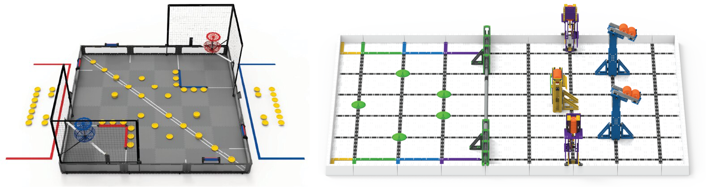{width=75%}
</center>

<small>https://www.vexrobotics.com/v5/competition/vrc-current-game</small>

<small>https://www.vexrobotics.com/iq/competition/viqc-current-game</small>

### Construction and Operation

The VEX V5/VEX IQ Robotics Design System offers students an exciting platform for learning about areas rich with career opportunities spanning science, technology, engineering, and math (STEM). These are just a few of the many fields students can explore by creating with VEX V5/VEX IQ Robotics technology. Beyond science and engineering principles, a VEX V5/VEX IQ Robotics project encourages teamwork, leadership, and problem-solving among groups. It also allows educators to easily customize projects to meet the level of students’ abilities.

<mark> VEX IQ Robotics is a SECME non-traveling student team competition.</mark>

Please follow the instructions below to participate in the SECME VEX V5/VEX IQ Robotics Competition.

1.	**Team Registration**: You are encouraged to register your team with VEX V5/VEX IQ Robotics at www.RobotEvents.com. Registration connects you to the system and gives you access to resources.
    a.	Registration costs $100 for the first team and $50 for each additional team at the same school.
    b.	Registration gets you access to the official VEX V5/VEX IQ Robotics Competitions and a welcome kit that includes:
        i.	Sample Game Pieces
        ii.	Robot License Tags
        iii.	Robot Flags
        iv.	Other promotional items
    c.	Teams **DO NOT** have to be registered with VEX to participate in “**SECME ONLY**” robotics events.

2.	**Competition Format**: SECME will follow the VEX V5/VEX IQ Robotics “Game Rules” and may or may not include the following:
    a.	Alliances
    b.	Head-to-head
    c.	Autonomous Period
    d.	Robot Skills Challenge
    e.	Programming Challenge

3.	SECME VEX V5/VEX IQ Robotics are non-qualifying competitions. Your student team does not have to place first in your local, district, state, or regional competition to compete at the SECME National Competition level. In the absence of a SECME VEX V5/VEX IQ Robotics competition at your local, district, state, or regional competition, the Coordinator must notify the SECME National Office that they have a student team(s) that they would like to be registered. The SECME National Office will provide the designated links to upload all required documents.

4.	**SECME Student Team Requirements**: VEX V5/VEX IQ Robotics is a non-qualifying SECME Competition. Student teams can be made up of one, two, or three students per team.

### VEX V5/VEX IQ Robotics Slapshot

https://www.vexrobotics.com/vexiq/

https://www.vexrobotics.com/v5/competition/vrc-current-game

https://www.vexrobotics.com/iq/competition/viqc-current-game

#### Robot Hardware

* If you already have a robot kit - reuse it.
    + We recommend getting a quote from your local reseller if you need VEX IQ Robotics     parts. It costs you nothing extra but brings you their local support.
    + Visit https://www.vexrobotics.com/how-to-order to find a reseller in your area
    + or visit the VEX IQ Robotics website at https://www.vexrobotics.com/.
*	You can also contact the SECME National office to direct you to the support representative for your state.

#### 2022-2023 Game

This year’s game is [Slapshot](https://www.youtube.com/watch?v=vF3I8FscrKo). With guidance from their SECME Coordinators, teachers, and mentors, students will build the most innovative robots possible and work together to obtain the most points possible. Students will learn many academic and life skills through participating in the VEX IQ Robotics Competition and their work within their team.

Click to access the official [VEX IQ Robotics Slapshot competition resources](https://www.vexrobotics.com.mx/vexiq/doctos/2022/2022-VIQC-GameManual2023.pdf). To see the [VEX IQ Robotics Slapshot video](https://www.youtube.com/watch?v=vF3I8FscrKo)

#### Student Team Requirements

VEX IQ Robotics is a non-qualifying SECME Competition. If your students compete in a virtual competition, student teams can be made up of one, two, or three students.

**In-Person Event**
The Final Score is based on the following criteria:

*	Performance Score		50%
*	Engineering Notebook		50%

**Virtual Event**
The Final Score is based on the following criteria:(when there is no performance score)

*	Engineering Notebook		50%
*	The Art of Engineering		50%

## Water Bottle Rocket Design Competition (WBR)

<center>
{width=50%}
</center>


### All Divisions - Construction and Operation

While promoting Space Propulsion Awareness, the Water Bottle Rocket Competition helps familiarize students with rocketry, design engineering, and manufacturing engineering principles. SECME students will **design and manufacture** a water bottle rocket using a two-liter bottle as the pressure vessel. Given specific launch criteria, the rocket must launch from the Water Bottle Rocket Launcher. Additionally, each SECME team will create a patch design, written or technical report, PowerPoint presentation (middle/high school division), and technical drawing.

We have added two new features for this competition year.

1.	All divisions must complete and submit the WBR calculation exercises. These exercises are included in the written/technical report

2.	Water Bottle Rocket (middle/high school) teams will now compete in the Art of Engineering competition segment. Teams must submit the AOE video presentation

Calculation Exercises:

**Grades Pre-K-2**

```{r echo=FALSE}
xfun::embed_file("/Users/kristadulany/Documents/GitHub/SECME/SECME Guidlines_22-23/Calc Manual/WBR_CalcManual_PK-2.pdf")
```

**Grades 3-5**

```{r echo=FALSE}
xfun::embed_file("/Users/kristadulany/Documents/GitHub/SECME/SECME Guidlines_22-23/Calc Manual/WBR_CalcManual_3-5.pdf")
```

**The Mission**
The mission is to design a Water Bottle Rocket Vehicle capable of staying aloft for the longest time (measured in seconds).

#### Regulations
1.	The pressure vessel must be ONE clear two-liter bottle (i.e., NO tinted bottles allowed for use as a pressure vessel). See [Diagram 1: Parts of a WBR].

2. $\color{red}{\text{Water and air pressure is the sole source of propellant. Do not use the following materials to construct your rocket.}}$
$\color{red}{\text{They are dangerous and could harm the operator and bystanders at launch.}}$

    a. $\color{red}{\text{Metal}}$

    b. $\color{red}{\text{Glass}}$

    c. $\color{red}{\text{Hard plastics}}$

    d. $\color{red}{\text{Spikes}}$

    e. $\color{red}{\text{Antennas of any kind}}$

    f. $\color{red}{\text{Rocks}}$
  
<center><mark> **NOTE: USE OF THESE MATERIALS WILL AUTOMATICALLY DISQUALIFY THE SECME TEAM** </mark></center>

3.	Leave 7.5 cm from the throat of the exit plane (bottom of the rocket) clear of any coverings (paint, markings, drawings, etc.). [Diagram 1: Parts of a WBR].

4.	The maximum total height of the rocket is 76 cm; [Diagram 1: Parts of a WBR].

5.	The Nose-cone tip must have a minimum radius of 1.5 cm; [Diagram 2: Nose Cone Diagram].

6.	Fins may extend to the throat exit plane; see [Diagram 2: Nose Cone Diagram].

<center><mark>**NOTE: No forward-swept types of fins are allowed to be used on the rocket.**</mark></center>

7.	The bottle’s maximum fin width distance is 10 cm (or 16.5 cm from the center of the bottle axis). See [Diagram 3: Fin Diagram].

8.	Parachutes are NOT allowed to be used.

### Elementary School Division - Construction and Operation

#### In-Person Event - Calculation of Water Bottle Score 

<center><mark>**NOTE: Each entry must pass a visual inspection and height requirement to be eligible to compete. Entries that fail inspection are given ONE opportunity to make modifications to pass inspection before the beginning of the water bottle rocket competition.**</mark></center>

An overall winner is determined by the following criteria (based on 100 pts):
* Final Hang Time of Rocket	40 %
* Patch Design			25 %
* Written Report			35 %

**Final Hangtime Score Calculation**

<center> $Final Hangtime Score=\frac{Hangtime}{Max Hangtime}x100%$ </center>

**Hangtime** is the time from when the rocket leaves the launch pad until it (or any part of it) reaches the ground or strikes an object. This measurement will be taken using a stopwatch by two or three (2-3) qualified judges. The average of the judges’ times will be used as the team’s hangtime.

**Max Hangtime** is the maximum hang time recorded during the SECME Competition.

The contest’s objective is for each SECME student team to launch a rocket-propelled by water and air and for it to stay aloft for the maximum amount of time (measured in seconds). The launch angle, which can be adjusted from approximately **90 degrees (90^o^)**, will be kept the **SAME** for all rockets launching during a particular competition. Each rocket will be launched using **12 oz water** at **70 psi of air pressure**.

NOTE: The maximum final elementary Water Bottle Rocketry score is 100 pts.

#### Virtual Event - Calculation of Water Bottle Rocket Score
There is no hangtime performance

The winner will be judged on the following criteria: (based on 100 pts):
* Patch Design			25 %
* The Art of Engineering		25%
* Written Report			50 %

The written report must include calculation exercises:

**Grades Pre-K-2**

```{r echo=FALSE}
xfun::embed_file("/Users/kristadulany/Documents/GitHub/SECME/SECME Guidlines_22-23/Calc Manual/WBR_CalcManual_PK-2.pdf")
```

**Grades 3-5**

```{r echo=FALSE}
xfun::embed_file("/Users/kristadulany/Documents/GitHub/SECME/SECME Guidlines_22-23/Calc Manual/WBR_CalcManual_3-5.pdf")
```

### Schematic Diagrams

#### Diagram 1: Parts of a WBR

<center>
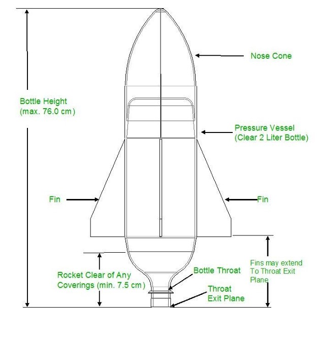{width=75%}
</center>


#### Diagram 2: Nose Cone Diagram

<center>
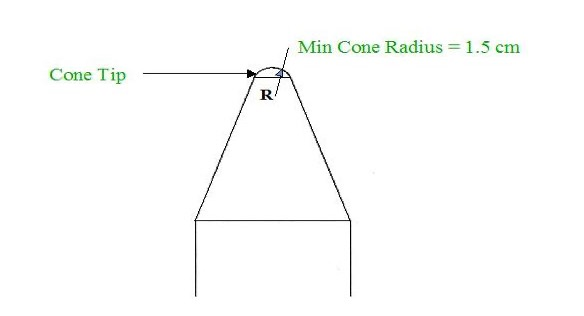{width=75%}
</center>

#### Diagram 3: Fin Diagram

<center>
{width=75%}
</center>

## Patch Design Challenge

**What is a patch? A patch is a creative display that reflects the dedication and mission of the SECME student team.**

**This symbolic picture must comply with the following patch design challenge:**

1. Each SECME student team is required to submit a completed patch design. 
    a. Check with your SECME local, district, state, and regional host for local submission deadlines
2. Before the launch, an operating rocket and patch design must be submitted to compete on the day of the competition. 

3. Each entry must be prepared and submitted by the SECME student team members participating in the Water Bottle Rocket Design Student Competition.

4. Patch designs must be submitted on a 13”× 13” poster board.

5. All patch entries must follow the SECME competition theme “School or ISL mascot or school motto.”

6. A short (less than one page) explanation of the patch’s symbols must be included on the back of the patch design (Refer to the example on the next page). The following information should be included on the back: 
	a. Competition (ex. SECME Water Bottle Rocket)
	b. Division (ex. Elementary School Division)
	c. SECME Team name
	d. Official School Name 
	e. Official School District Name
	f. SECME Student Members’ Names and Grade Levels
	g. Student Coordinator’s/Teacher’s Name

7. All SECME student teams participating in the SECME Water Bottle Rocket Student Competition must display their patch before their rocket launch.

8. Patch Design must be the original work of the SECME student team. It must be hand-made (not computer-generated) and age-appropriate.

9. Teams may only use ink pens, pencils, colored pencils, crayons, markers, or paint.

<center><mark>**NOTE: Inappropriate patch designs will be removed from the competition. The SECME team will receive a score of zero for patch design.**</mark></center>

**The patch design will be judged on the following criteria:**

1. Paper Size Requirement 13” x 13” poster board)
2. Theme: “School or ISL mascot or school motto.”
3. Appearance 
4. Creativity 
5. Explanation of Patch – Less than a one-page explanation of your patch 

### Example Patch Design

<center>
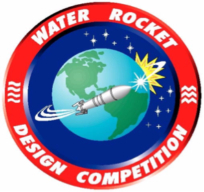{width=50%}
</center>

**Example Explanation of Patch**

The propelled rocket represents the school system, supported by educators and students, following a path towards excellence. The radiant five 8-point stars symbolize the enrichment of Science, Engineering, Communication, and Mathematics, whereas the seven 4-point stars represent the seven Universities that founded SECME. The three distinct contrails STEMing behind the rocket symbolize the support offered by SECME, Universities, and Industry partners. The ring before the rocket depicts a student’s path through the SECME program, returning full circle to support the program’s efforts. As we have entered the new millennium, the sun over the horizon symbolizes the induction of the new Water bottle rocket Design Competition into the SECME Programs. Accuracy, the contest’s focus, represents the target created by the outer ring, deep space, and the earth. The border is supported on the left and right by the water and compressed air symbols; the fluids used to propel the rockets. 


## The Art of Engineering (AOE)

### The Art of Engineering Showcase

What is the Art of Engineering (AOE)? AOE is an opportunity for SECME student teams to showcase and discuss the design approach used for their car/rocket/robot. **The AOE competition only takes place at National Competition Finals**.

The AOE Video Presentation replaces the live, in-person AOE Showcase.

1.	This video presentation showcases the ART in the SECME student team engineering design of their car/rocket/robot.

2.	Each SECME student team will submit a five to seven-minute video on their car/rocket/robot from a creative, innovative, and artistic perspective.

In the video, teams will:

*	Introduce their team and themselves
*	Introduce their final design
*	Walk through their design process
      + Brainstorming design ideas – initial sketches and ideas
      + Prototype Versions – at least two versions
          - What each prototype looked like (image or drawing)
          -	What changes were made from each version
      +	Final Design
          -	Technical drawing and image
          - What changes were made from the last prototype
          - Why this design is your final design

Every student team member must contribute to a piece of the video to get all possible points. Be interactive and engaging in your presentation.

**Dress Code**: The Art of Engineering showcase’s required dress code is a polo shirt (in your school colors) and khaki pants.

## Essay and Vision Board Competition

<center>
{width=75%}
</center>

### Essay and Vision Board Introduction

What is the Essay/Vision Board competition SECME’s essay/vision board competition is a written and illustrative representation (vision board) on any of the three topics listed below. All essay/vision board submissions will require a cover page.

#### Topics
1. How has participation in SECME helped me to discover my STEM dream job?

2. How has the COVID-19 pandemic shown the importance of STEM?

3. Environmental issues
    a. Forest Fires
    b. Global Warming
    
Topics are open to all grade levels; however, some topics may require more critical thinking, explanations, and details, depending on the grade level.

When choosing topics 2 or 3, answer the questions:

A. How does or how should STEM impact these global or environmental issues? 

B. How do you see yourself contributing to the solution to these global or environmental issues? We encourage you to use your imagination.

#### Competition Requirements

Follow all instructions. Each essay and vision board entry must be prepared and submitted by an individual SECME student.

When choosing topics 2 or 3, answer the questions:

  A. How does or how should STEM impact these global or environmental issues?
  
  B. How do you see yourself contributing to the solution to these global or environmental issues? We encourage you to use your imagination.

The vision board can be developed by hand or by using a computer program. For boards created by hand, teams can use materials such as magazine clippings, newspaper clippings, crayons, markers, colored pencils, colored pens, or paint. Clip art or electronic visual graphics are allowed when designing on a computer. Your vision board must be one page, and it can either be positioned in portrait or landscape.

### Grades Pre-K – 2

Choose a topic. Create your vision board on paper. Next, working with your SECME Coordinator or parent/guardian, record a four-minute maximum video message explaining your vision board and how participation in SECME has helped you to choose that career path.

Submission of your vision board must include the following:

1.	Required cover page
2. Vision Board drawing is one page in length and can be positioned either in portrait or landscape
3. Four-minute (max) video explaining your vision board


If you choose Topic 1, you simply will draw on your vision board what job in STEM (Science, Technology, Engineering, and Mathematics) you would like to have when you grow up. 

### Grades 3 – 5

Choose a topic. Write your essay. Create your vision board to show what your essay represents. Write a paragraph or two describing your vision board.

Writing is critical, but it is a learned skill, and some students perfect it sooner than others. As an optional addition to writing, you may record a four-minute video explaining your vision board!

Submission of the essay/vision board must include the following:

1.	Required cover page
2.	The essay should contain 500 – 1,000 words
3.	Write a one-paragraph description of your vision board (note that your description should be included in your essay, not on the vision board page)
4.	Vision Board drawing is one page in length and can be positioned either in portrait or landscape
5.	Four-minute (max) video explaining your vision board (optional)

If you choose Topic 1, you will write an essay containing 500-1,000 words describing what STEM Science, Technology, Engineering, and Mathematics job you would like and how participation in SECME helped you choose that career path.


### Phases

**[Phase 1: Interest Inventory]**

**[Phase 2: Career Search]**

**[Phase 3: Education Research]**

**[Phase 4: Essay]**

**[Phase 5: Vision Board]**

**Optional**: Video explanation of your vision board (two to four minutes)

#### Phase 1: Interest Inventory

It’s all about YOU! and Science, Technology, Engineering, and Mathematics
Topic 1: How has participation in SECME helped me to discover my STEM dream job?
What **STEM**ulates your imagination? What SECME experiences are interesting, enjoyable, and fun? Do you enjoy working with a team in SECME to build mousetrap cars, balsa wood bridges, and water bottle rockets in SECME? Do you enjoy creating a technical drawing that shows the design of your mousetrap car or water bottle rocket used in a SECME competition? What other activities do you work on in your SECME class or club? Do you like coding? Do you like solar energy? Do you like the challenge of figuring out ways to build a “better” car or bridge or water bottle rocket in SECME? Do you like researching exciting science, technology, engineering, and mathematics topics? Do you like to plan big projects?

Ask yourself: How has participation in SECME helped me? How has my involvement in SECME helped me to grasp the challenging concepts of STEM? 

1.	Get out your journal and answer these questions for yourself. Take your time, do not worry about going fast. Search your memories and write down your thoughts.

2.	Now, talk to your friends, teachers, and relatives – ask them what they think YOU enjoy and write down their answers in your journal (you might be surprised by what they say!).

3.	Have they observed how your SECME experience has helped you?

4.	Then do some Internet research. Below are some interesting links, but you are not limited to just these! Ask your teacher to help you find other sites to visit. 

Take your time and have fun! Do not forget to use your journal to write down information – use as many pages as you want. You never know what you might need for the next phases of your exploration. Explore these other websites to help you get started.

**Links to Explore**

http://www.discovere.org/discover-engineering http://www.greatachievements.org/

http://stemcareer.com/ http://www.onetonline.org/find/stem?t=0 

http://www.wisegeek.com/science.htm

#### Phase 2: Career Search

Topic 1: How has participation in SECME helped me to discover my STEM dream job?

On this next leg of your exploration, it’s time to find out what career just might be for you! Let yourself be surprised by what you might find. It could be something that you never knew was a job. The links below are just the beginning. Ask for help to find other good internet sites. And do not forget to use your journal to log all the places you will go! You never know when you might want to check your journal as you move through the next phases of your journey.

1. First, visit the SECME Website (www.secme.org). On the green menu bar across the top, hover your mouse over “More” and click on “Government & Industry Partners.” When you click on this link, you will see the seven (7) corporations that are major SECME sponsors. Click on each one to visit their websites – have fun looking at all the cool things they do!

2. Plan to take a few days for this next step in your exploration: Go back to the green menu bar at the top of the website and hover your mouse over “More.” This time, click on “Other Alliance Partnerships.” There are many industries and government agencies that help to support your SECME program in many ways. Find a familiar one, click on its link, and explore its website. Then find one you have never heard of before and explore it, too. Take a few days to explore all the links. You will be STEMulated by all the opportunities and information just waiting to be discovered!

3. Now that you have new information about many different industries and government agencies. Visit some websites that tell you about other careers in Science, Technology, Engineering, and Mathematics. There are several listed below you can go to, but don’t stop there! Get some help to find other information. And, of course, don’t forget to use your journal to record all the interesting information you discover!

**Links to Explore**

http://www.aboriginalaccess.ca/adults/types-of-engineering

http://www.egfi-k12.org/

http://www.egfi-k12.org/#/cards/mechanical http://www.egfi-k12.org/#/cards/computer

http://teachers.egfi-k12.org/resource-engineering-scholarships/ 

http://www.stem-works.com/ http://www.coolmath.com/careers.htm 

http://www.ams.org/ams/what-mathdegree.pdf http://www.maa.org/careers/ 

http://www.pbs.org/safarchive/5_cool/53_career.html 

http://library.thinkquest.org/J0113274/index.htm


#### Phase 3: Education Research
Fun Facts about SECME and its University Partners

Topic 1: How has participation in SECME helped me to discover my STEM dream job?

Your journal should be full of information now.

Look back at your notes from Phase 1 and Phase 2 of your exploration. Do you have some ideas about what you like to do and about careers that just might be fun for you to pursue? SO, NOW WHAT? Time to explore how to get prepared for a STEM career! HOW? You need to consider what kind of education you will need. In this phase of your journey, you will visit universities across the country. Prepare to be surprised about how different they are! Take careful notes in your journal.

It’s back to the SECME Website (www.secme.org) homepage link. Hover your mouse over “More” and select “Member Universities.” Suppose you click the “Founding Universities” button in the upper right. In that case, you find the names of the six Deans and their universities that first met in 1975 to create SECME to encourage students like you to go to college and get degrees to lead to STEM careers. That was 46 years ago! Can you imagine how many SECME students have been through the SECME program over the past 46 years because these Founders of SECME wanted kids to explore STEM careers?

1. Now go back to one page to see the “SECME University Council Member Institutions.” You will find a listing of universities with engineering programs supporting SECME! These university engineering programs are just waiting for you to get to know them!

2. Get a map of the United States and explore different universities online. Find their locations on the map. What university is closest to you? What university is the farthest away?

3. Most university engineering programs have interesting information and fun summer programs. Explore the sites and see what you can find!

4. Which university engineering schools look like places you could see yourself in the future?

5.Which university majors and degrees might you pursue to achieve your career goals in STEM?

There are tons of information at your fingertips – Enjoy! Don’t forget to take good notes! You’re almost ready to start your essay!


#### Phase 4: Essay

Topic 1: How has participation in SECME helped me to discover my STEM dream job?

You’ve done a lot of work. Time to put it all together and use your new knowledge to persuade the SECME Essay Competition judges that you have figured out your destination!

In Phase 4, you will need to be diligent. You’ve gathered a good bit of research, and now you need to decide how you can use it. The competition judges want you to help them understand:

1. What STEMulates your mind in Science, Technology, Engineering, and Mathematics?

2. What has your research shown you? Is it possible you have found the career you want to pursue? 

3. What has your research shown you? Is it possible you have found the university or college you will attend? 

Don’t make the mistake of thinking that this phase of your journey will be easy. You will want to take your time and write several drafts before submitting your work to your SECME Coordinator.

It’s ok to ask for help after you write your drafts. However, YOU need to ensure that your essay is in YOUR words! The judges want to feel like YOU are talking to them, not a parent, teacher, or friend…YOU! 

Others can ensure that your final copy is correct, without errors, but they should NOT express your feelings for you – they are YOUR ideas and reactions to what you have discovered during your exploration. And don’t forget to let the judges know if you were surprised by any information you found in your research – they would be interested to learn that your journey was a success. A successful personal exploration will be when you learn something about yourself – about what gets you excited and ready to go for your goals. Be sure to share something that you did NOT know before you started!!

So, it’s time to think, write, re-write, edit, and then move on to Phase 5!

#### Phase 5: Vision Board

Topic 1: How has participation in SECME helped me to discover my STEM dream job?

This vision board is a visualization of your future STEM career. Using art, create a vision board that depicts your future career path and expresses your hopes and dreams in Science, Technology, Engineering, and Mathematics. 

SECME students can use clip art, electronic visual graphics, magazine clippings, newspaper clippings, crayons, markers, colored pencils, colored pens, and paint.

**Grades Pre-K-2** are required to submit a video explanation of their vision board no longer than 4 minutes.

**Grades 3-12** are required to submit a one-paragraph description of their vision board. They can submit an optional video explanation of their vision board no longer than 4 minutes.

SECME students put their vision board on an 8.5” × 11” white paper. The page layout (or the paper orientation) can be either landscape or portrait. 

The Vision Board will be judged on the following criteria:

1. Paper Size Requirement (8.5” × 11”)

2. Harmony between the essay and vision board

3. Appearance, Effort, Creativity, Originality

4. Video explanation of the Vision Board (Pre-K-2 grades)

5. One paragraph explanation of the Vision Board (3-12 grades)

# Reporting Materials

## Reporting Checklist

Required for Competition

The following are the required SECME competition documents, reports, videos, and forms that the SECME Coordinator must electronically upload on or before **Monday, April 10, 2023**. Required competition reports not submitted will result in a zero score for that section. Except for videos, ALL work must be converted to a PDF document before submission.

```{r echo=FALSE}
xfun::embed_file("/Users/kristadulany/Documents/GitHub/SECME/SECME Guidlines_22-23/docs/Reporting Checklist.pdf")
```
<center>
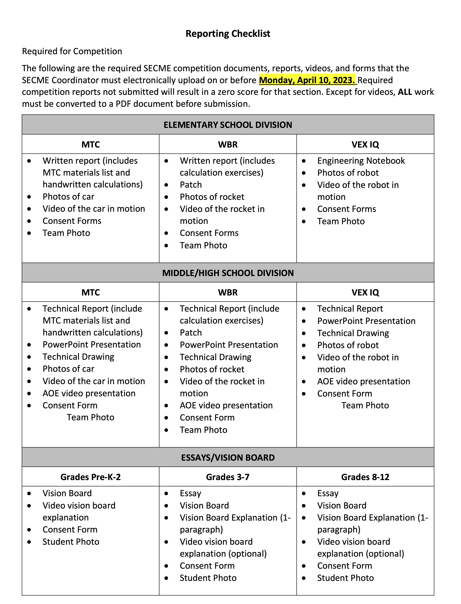{width=75%}
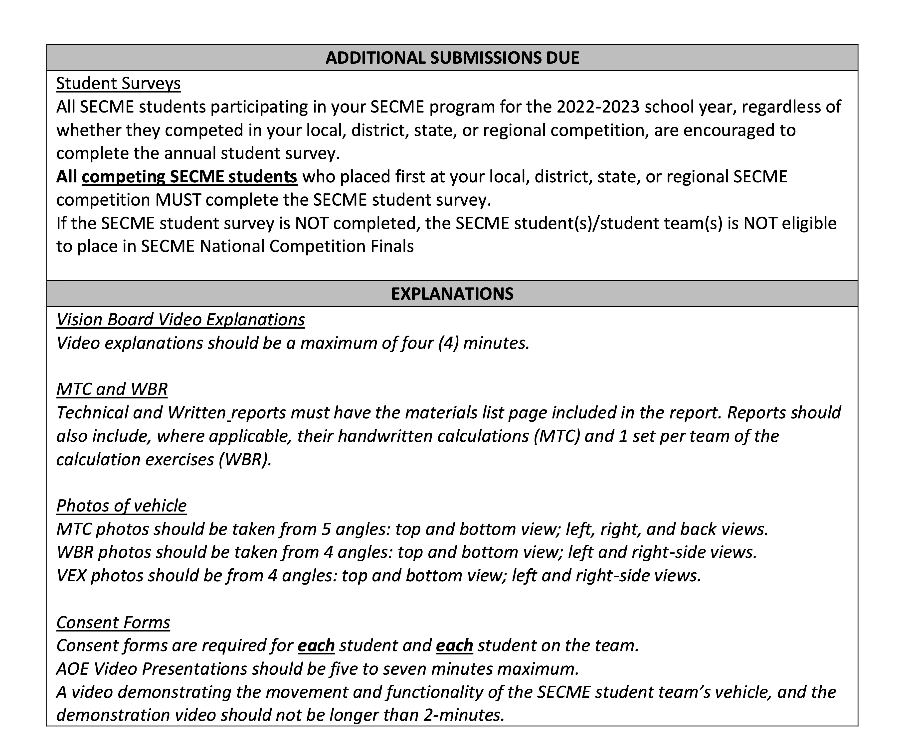{width=75%}

</center>

## SECME Registration Information

Below is the information needed to register 1st place winners for qualifying and non-qualifying competitions. Registration opens **Monday, March 13, 2023**, and closes on **Monday, April 3, 2023**. A registration link will also be sent with instructions to complete registration.

```{r echo=FALSE}
xfun::embed_file("/Users/kristadulany/Documents/GitHub/SECME/SECME Guidlines_22-23/docs/SECME Registration Information.pdf")
```
<center>
{width=100%}
</center>

## SECME Consent Form - Photo/Video

```{r echo=FALSE}
xfun::embed_file("/Users/kristadulany/Documents/GitHub/SECME/SECME Guidlines_22-23/docs/SECME Consent Form.pdf")
```

<center>
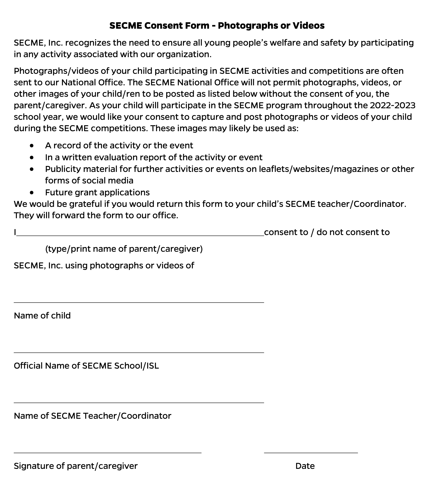{width=75%}
</center>


## Saving Reports and Documents
Essay/Vision Boards, Vision Board Videos, Picture Books, Posters, Written, and Technical Reports, PowerPoint Presentations, Engineering Notebooks, and AOE Videos

### SECME Coordinators

Please follow the dates and methods for submission in these guidelines and the dates and methods required by your SECME local, district, state, or regional competition host.

### Tips

1. All reports, essays, vision boards, picture books, posters, and forms must be submitted in PDF format.

2. To save an MS Word document as a PDF file, click the “File” button, choose “Save As,” name the file in the “Filename” field, change the “Save as type” to PDF, and then click the “Save” button. 

3. Keep the documents saved in several locations or on multiple computers so that all team members and the school coordinator can access them at any time.

4. Make sure that all copies stay updated with the latest changes and edits.

5. Plan time to work on the documents from the beginning of the project. Do not wait until the last minute.

6. Make sure all required sections are included.

7. Spell-check/grammar-check.

8. Carefully re-read the entire completed document.

9. Upon finding mistakes: 
    a. Make changes/edits.
    b. Re-save the updated document.
    c. Repeat these suggestions until satisfaction is achieved.

10. New. Coordinators must also submit ALL required competition documents to the SECME National Office for your 1st place winners by **Monday, April 10, 2023** (see [Reporting Checklist]).

Video files can be in the following formats: MP3/MP4. 

## Acceptable Fonts

<center>
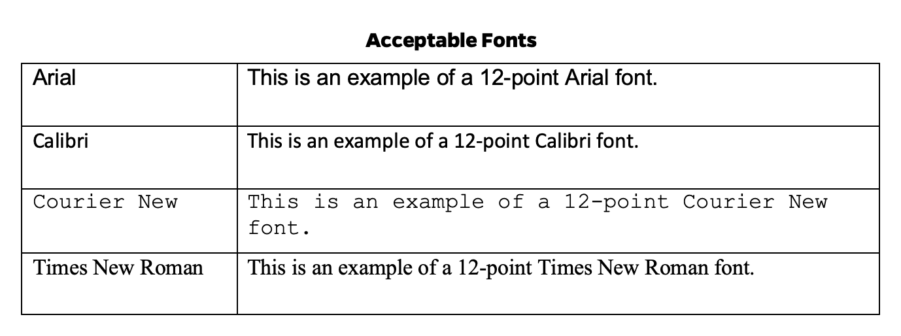{width=75%}
</center>

## Sample Cover Page

**Essay and Vision Board**

<center>Title: Topic

Student Name (First and Last Name)

Student Grade

Official District Name

Official School Name

City, State

SECME School Coordinator’s Name or Teacher’s First and Last Name

Coordinator/Teacher email address
</center>

**All Team Competitions**

<center>Title: 

*(Example) SECME Engineering Design Competition: Mousetrap Car Written Report*

Division: 

*(Example) Elementary School Division*

Team Name: *Mouseketeers*

Student 1 Name (First and Last Name)
Student Grade
Student Email

Student 2 Name (First and Last Name)
Student Grade
Student Email

Student 3 Name (First and Last Name)
Student Grade
Student Email

Official District Name
Official School Name
City, State

SECME School Coordinator’s Name or Teacher’s First and Last Name
Coordinator/Teacher email address
</center>

## Materials List


```{r echo=FALSE}
xfun::embed_file("/Users/kristadulany/Documents/GitHub/SECME/SECME Guidlines_22-23/docs/Materials List.pdf")
```
<center>
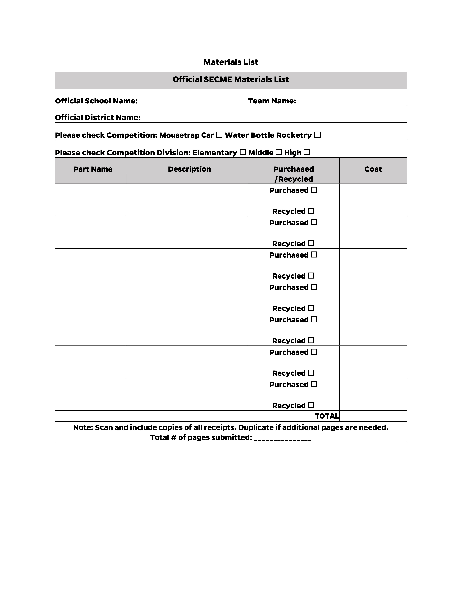{width=75%}
</center>

## SECME Grievance Form

[Linlk to the SECME Grievance Form](https://forms.gle/U4q4gSnznZsCw9yL7)


```{r echo=FALSE}
xfun::embed_file("/Users/kristadulany/Documents/GitHub/SECME/SECME Guidlines_22-23/docs/SECME Grievance Form.pdf")
```
<center>
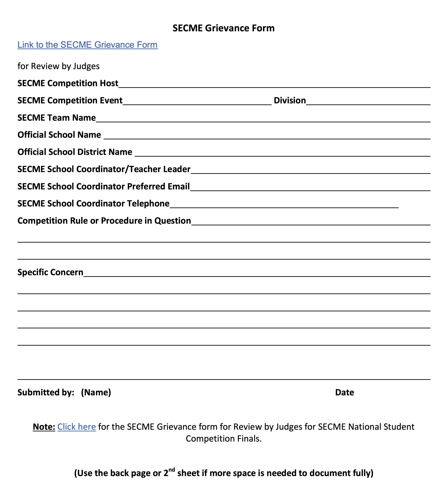{width=75%}
</center>

# Judging Evaluation Forms

## Written Report Evaluation (MTC/WBR)

### Instructions

As a part of the Engineering Design Competition, the SECME student(s)/student team(s) is required to write a Written Report describing the design, construction, and operation of the Mousetrap Car or Water Bottle Rocket. The main body of the report should be a maximum of two pages. 

<mark>**EVIDENCE OF PLAGIARISM OR RE-SUBMISSION OF PREVIOUS YEARS’ REPORTS WILL RESULT IN A ZERO SCORE.**</mark>

#### Structure

1. Cover page
      a. Title of the SECME Written Report – The title is this year’s competition theme
      b. SECME Competition Division 
      c. SECME Team Name
      d. Each SECME student team member’s name, grade
      e. Official School District Name
      f. SECME team’s official school name, city, state, and zip
      g. SECME School Coordinator’s (or Teacher’s) name and email

2. Double-spaced text

3. One-inch borders at the top, bottom, and on each side 
4. 12 pt. acceptable standard font, computer typed
5. The report is neat; the pages are numbered (do not number the cover page)

#### Content

1. Writing includes an original introduction and conclusion

2. Writing contains ideas that are fully developed, fully supported, and describe the design, construction, and operation of the vehicle

3. Writing is logical and coherent as a whole
4. Mousetrap Car must include handwritten calculations.
5. Water Bottle Rocketry must include calculation exercises
6. The written report should include the completed Materials List with receipts (These should not be counted in the two-page limit).

#### Mechanics, Spelling, and Grammar

The written report should reflect the SECME student(s)/student team(s) professionalism and pride, free of errors. 

<center><mark> NOTE: Written Reports not submitted will receive a zero score.</mark></center>

### Written Report Judge’s Form (MTC/WBR)

```{r echo=FALSE}
xfun::embed_file("/Users/kristadulany/Documents/GitHub/SECME/SECME Guidlines_22-23/docs/Written Report Judge MTC_WBR.pdf")
```
<center>
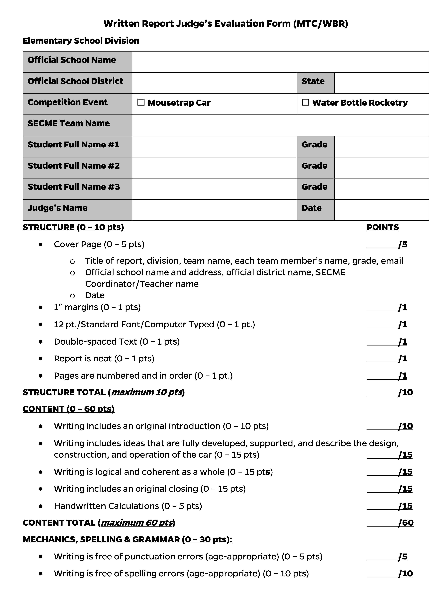{width=75%}
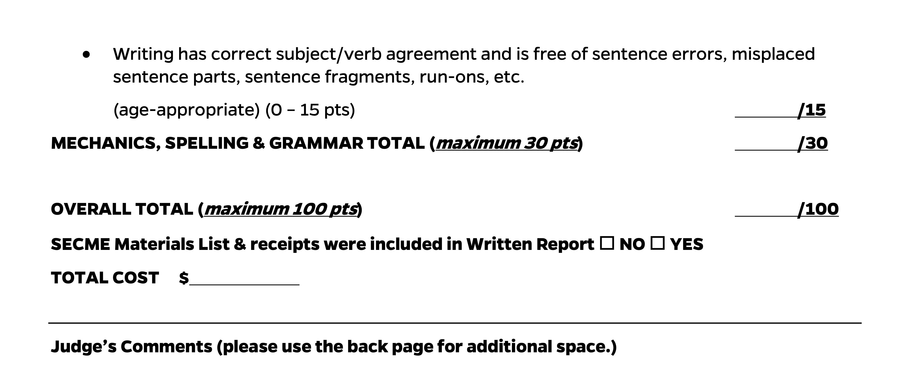{width=75%}
</center>

## Mousetrap Car Judging

### MTC Judge’s Evaluation Form – In Person

**Construction and Evaluation**

```{r echo=FALSE}
xfun::embed_file("/Users/kristadulany/Documents/GitHub/SECME/SECME Guidlines_22-23/docs/Mouse Trap Car Judging_InPerson.pdf")
```
<center>
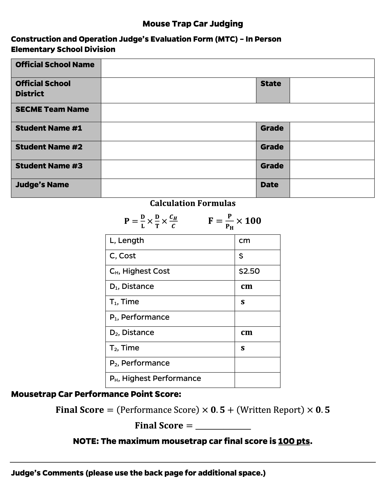{width=75%}

### MTC Judge’s Evaluation Form – Virtual

**Construction and Evaluation**

```{r echo=FALSE}
xfun::embed_file("/Users/kristadulany/Documents/GitHub/SECME/SECME Guidlines_22-23/docs/Mouse Trap Car Judging_Virtual.pdf")
```
<center>
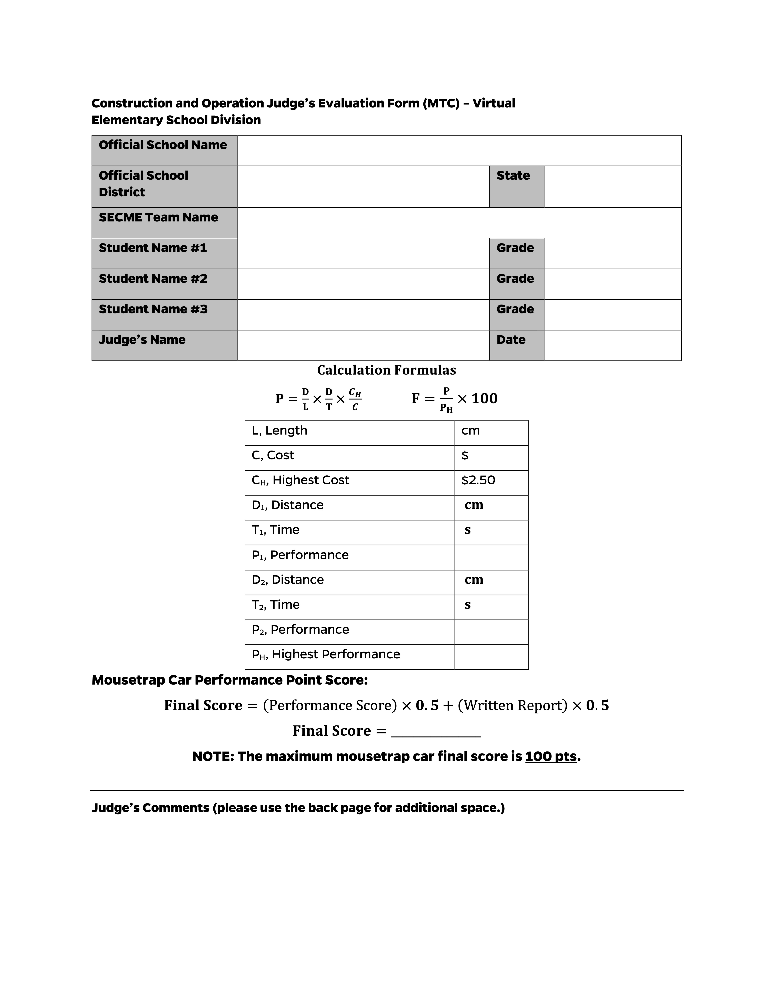{width=75%}
</center>

## VEX V5/VEX IQ Robotics Judging

### Engineering Notebook Judge’s Evaluation Instructions

One of the VEX V5/VEX IQ Robotics Competition’s main missions is to help SECME student teams acquire real-world life skills to benefit them in their academic and professional future. The Engineering Notebook is a way for student teams to document the engineering design process during the VEX V5/VEX IQ Robotics Competition. The engineering notebook gives student teams the practice of essential life skills, including project management, time management, brainstorming, and teamwork. The engineering notebook reflects the documentation of the student team’s design decisions and efforts in creating a novel and innovative competitive robot. SECME student teams should start their engineering notebooks early and update them often and daily. Write handwritten notes and documentation neatly and clearly for judges to read without difficulty. 

Engineering is an iterative process requiring students to recognize and define a problem, brainstorm, and work through various stages of the design process, test their designs, improve their designs, and continue the process until a solution has been produced. During this process, students will come across obstacles, encounter successes and failures, and learn many lessons. It is this process that students should document in their Engineering Notebook. 

The engineering notebook is an opportunity to document everything a SECME student team does and serve as a historical guide of lessons learned and best practices that can benefit the SECME student team in future years. SECME students may document any number of things in their engineering notebooks. For example, team meeting notes, design concepts and sketches, pictures, notes from competitions, biographies of the members of their team (students, teachers, Coordinators, and mentors), observations and thoughts of team members throughout the season, team organization practices, and any other notes that a team finds useful.

#### Requirements
1. Cover page
    a. Title of the Engineering Notebook – Example: SECME Engineering Design Competition: VEX V5 or VEX IQ Robotics Engineering Notebook
    b. SECME Team Name
    c. Each SECME student team member’s name, grade
    d. Official School System/District Name
    e. SECME team’s official school name, city, state, and zip
    f. SECME School Coordinator’s (or Teacher’s) name and email

2. Table of Contents

3. Provide a brief description of each SECME team member and their strengths and benefits

4. Design ideas

5. SECME Team meeting notes (daily entries)

6. Construction of the robot

7. Operation 
    a. Describe how the robot has been designed to achieve the object of the VEX V5/VEX IQ Robotics game and general novel features

8. Problems encountered and methods to resolve them

9. Conclusion/Future Recommendations

### Engineering Notebook Judge’s Evaluation Form 

```{r echo=FALSE}
xfun::embed_file("/Users/kristadulany/Documents/GitHub/SECME/SECME Guidlines_22-23/docs/Engineering Notebook Judge.pdf")
```
<center>
{width=75%}
</center>

## Water Bottle Rocket Judging

### WBR Judge’s Evaluation Form – In Person

```{r echo=FALSE}
xfun::embed_file("/Users/kristadulany/Documents/GitHub/SECME/SECME Guidlines_22-23/docs/WBR Judging_InPerson.pdf")
```
<center>
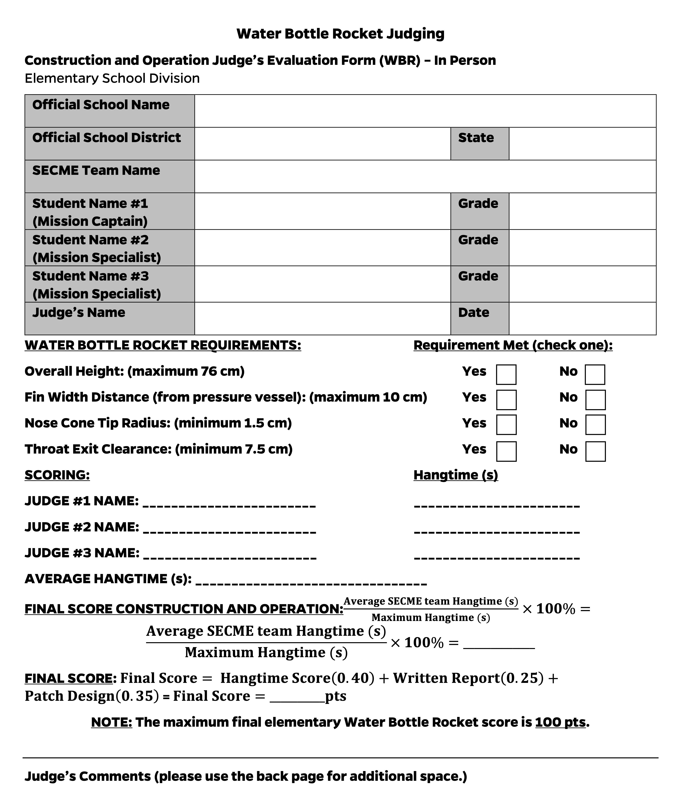{width=75%}
</center>


### WBR Judge's Evaluation Form - Virtual

```{r echo=FALSE}
xfun::embed_file("/Users/kristadulany/Documents/GitHub/SECME/SECME Guidlines_22-23/docs/WBR Judging_Virtual.pdf")
```
<center>
{width=75%}
</center>


## Patch Design Challenge 

### Judge’s Evaluation Instructions (WBR)

What is a patch? A patch is a creative display that reflects the dedication and mission of the SECME student team. This symbolic picture must comply with the following patch design challenge:

<center>
{width=50%}
</center>

<mark>NOTE: Inappropriate patch designs will be removed from the competition. The SECME team will receive a score of zero for patch design.</mark>

**The Patch Design will be judged on the following criteria:**
	
1. Paper Size Requirement (13”×13” poster board)
2. SECME Theme - “School or ISL mascot or school motto.”
3. Appearance 
4. Creativity 
5. Explanation of Patch 

### Patch Design Challenge Judge’s Evaluation Form

```{r echo=FALSE}
xfun::embed_file("/Users/kristadulany/Documents/GitHub/SECME/SECME Guidlines_22-23/docs/Patch Design Challenge_Judge Eval.pdf")
```
<center>
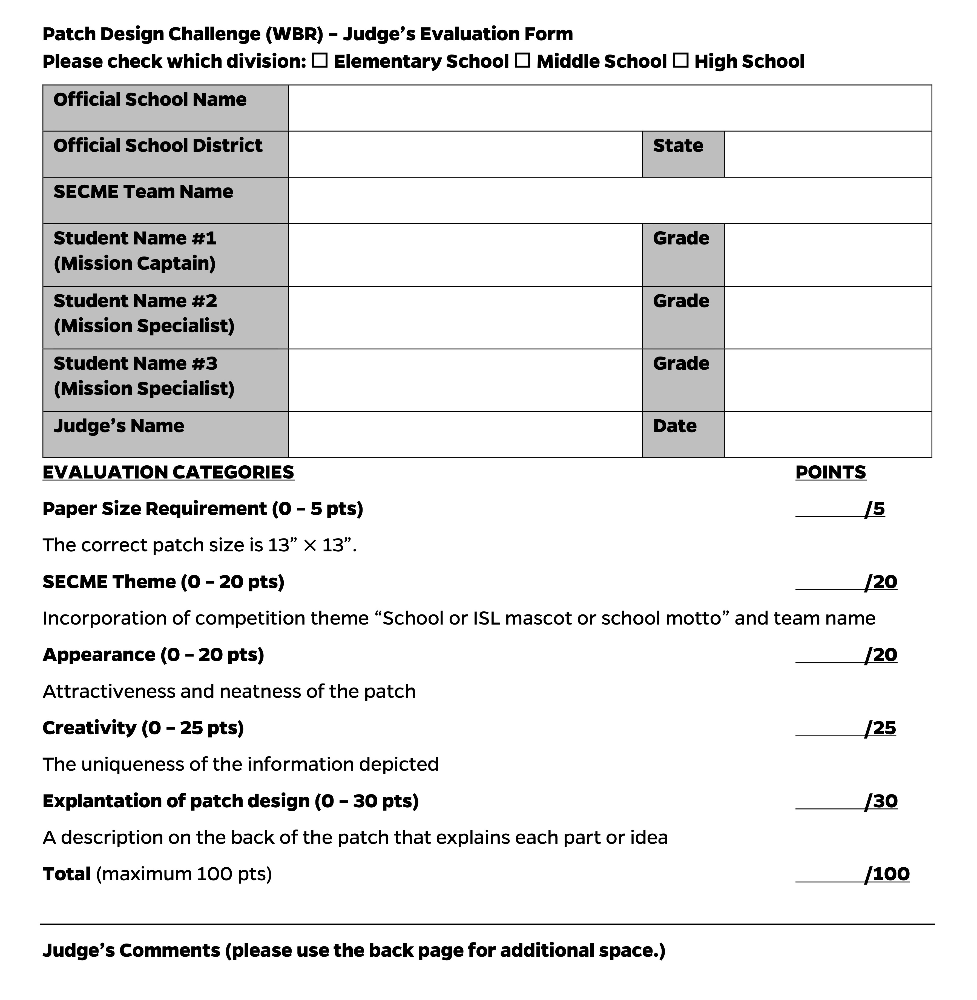{width=75%}
</center>

## The Art of Engineering 

### Judge’s Evaluation Instructions

This competition component showcases the ART in the SECME student team engineering design of their vehicle.

Each middle/high school division Mousetrap Car, Water Bottle Rocket, VEX IQ Robotics, and VEX V5 Robotics SECME student team will submit a five to seven-minute video on their car, rocket, or robot from the creative, innovative, and artistic perspective. In other words, sell your car’s, rocket’s, or robot’s capabilities creatively and informally. Every SECME student teammate must contribute to the team to get all possible points. Your video should introduce your SECME student teammates and display your technical drawing and vehicle. 

**The Art of Engineering will be judged on the following criteria**:

* Creative and Innovative 

* Five to seven-minute Video Presentation

### AOE Judge’s Evaluation Form - Virtual

```{r echo=FALSE}
xfun::embed_file("/Users/kristadulany/Documents/GitHub/SECME/SECME Guidlines_22-23/docs/The Art of Engineering Judge Eval.pdf")
```
<center>
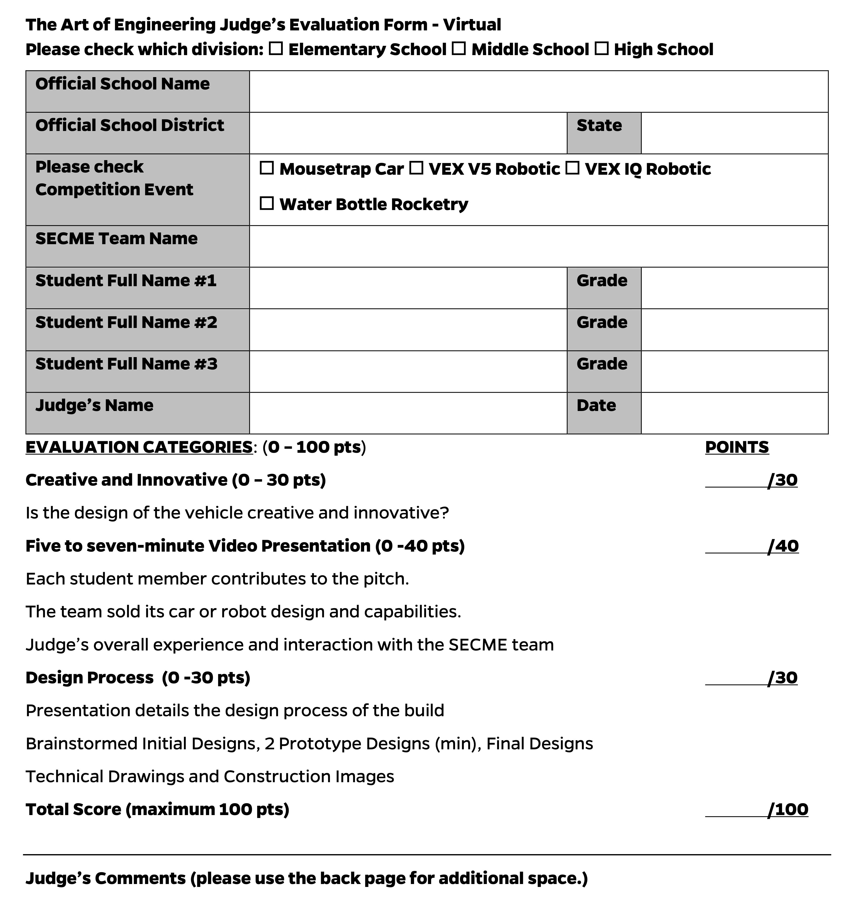{width=75%}
</center>

## Essay/Vision Board

### Judge’s Evaluation Instructions

#### Introduction

What is the Essay/Vision Board competition? SECME’s essay/vision board competition is a written and illustrative representation (vision board) on any of the three topics listed below. ALL essay/vision board submissions will require a cover page.

1. How has participation in SECME helped me to discover my STEM dream job?

2. How has the COVID-19 pandemic shown the importance of STEM?

3. Environmental issues
    a. Forest Fires
    b. Global Warming
    
Topics are open to all grade levels; however, some topics may require more critical thinking, explanations, and details, depending on the grade level. When choosing topics 2 or 3, answer the questions: (1) How does or how should STEM impact these global or environmental issues? (2) How do you see yourself contributing to the solution to these global or environmental issues? We encourage you to use your imagination.

#### Competition Requirements
Follow all instructions. Each essay and vision board entry must be prepared and submitted by an individual SECME student. When choosing topics 2 or 3, address: (1) How does or how should STEM impact these global or environmental issues? (2) How do you see yourself contributing to the solution of these global or environmental issues? We encourage you to use your imagination.

The vision board can be developed by hand or by using a computer program. For boards created by hand, teams can use materials such as magazine clippings, newspaper clippings, crayons, markers, colored pencils, colored pens, or paint. Clip art or electronic visual graphics are allowed when designing on a computer. Your vision board must be one page, and it can either be positioned in portrait or landscape.

**Grades Pre-K – 2**

Choose a topic. Create your vision board on paper. Next, working with your SECME Coordinator or parent/guardian, record a four-minute maximum video message explaining your vision board and how participation in SECME has helped you to choose that career path.

**Submission of your vision board must include the following**:
1.	Required cover page
2. Vision Board drawing is one page in length and can be positioned either in portrait or landscape
3. Four-minute (max) video explaining your vision board

**The vision board and video will be judged on the following criteria:**

* Includes required cover page, vision board 
*	Paper size Requirements
*	Appearance/Effort 
*	Creativity/Originality 
*	Video explanation of vision board

**Grades 3 – 5**

Choose a topic. Write your essay and visually depict your essay by creating a vision board on paper. 

**Submission of the essay/vision board must include the following**:

1. Required cover page
2. The essay should contain 500 – 1,000 words
3. Write a one-paragraph description of your vision board (the description should be included in your essay and not on the vision board page)
4. Vision Board drawing is one page long and can be positioned either in portrait or landscape
5.	Four-minute (max) video explaining your vision board (optional)

**The essay will be judged on the following criteria**:

*	Essay Organization
*	Content and Focus
*	Writing Style
*	Format, Punctuation, and Mechanics

**The vision board and video explanation will be judged on the following criteria**:

*	Appearance/Effort 
*	Creativity/Originality
*	Explanation of vision board (1-paragraph or 2 - 4-minute video)

#### Phases

Phase 1: Interest Inventory

Phase 2: Career Search

Phase 3: Education Search

Phase 4: Writing

Phase 5: Illustrations

Click [Phases] to return to the guidelines

### Vision Board Judge’s Evaluation Form - P-2

```{r echo=FALSE}
xfun::embed_file("/Users/kristadulany/Documents/GitHub/SECME/SECME Guidlines_22-23/docs/Vision Board_Judge Eval_P2.pdf")
```
<center>
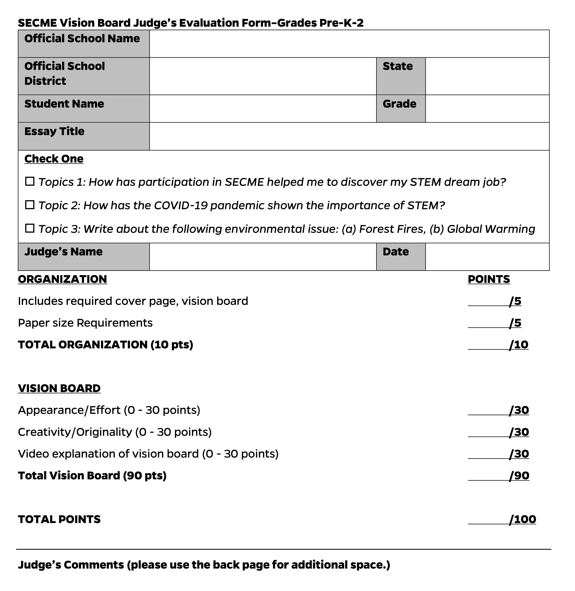{width=75%}
</center>


### Essay/Vision Board Judge’s Evaluation Form - 3-12

#### Topic 1

```{r echo=FALSE}
xfun::embed_file("/Users/kristadulany/Documents/GitHub/SECME/SECME Guidlines_22-23/docs/Essay_Vision Board_Judge Eval_3-12_T1.pdf")
```
<center>
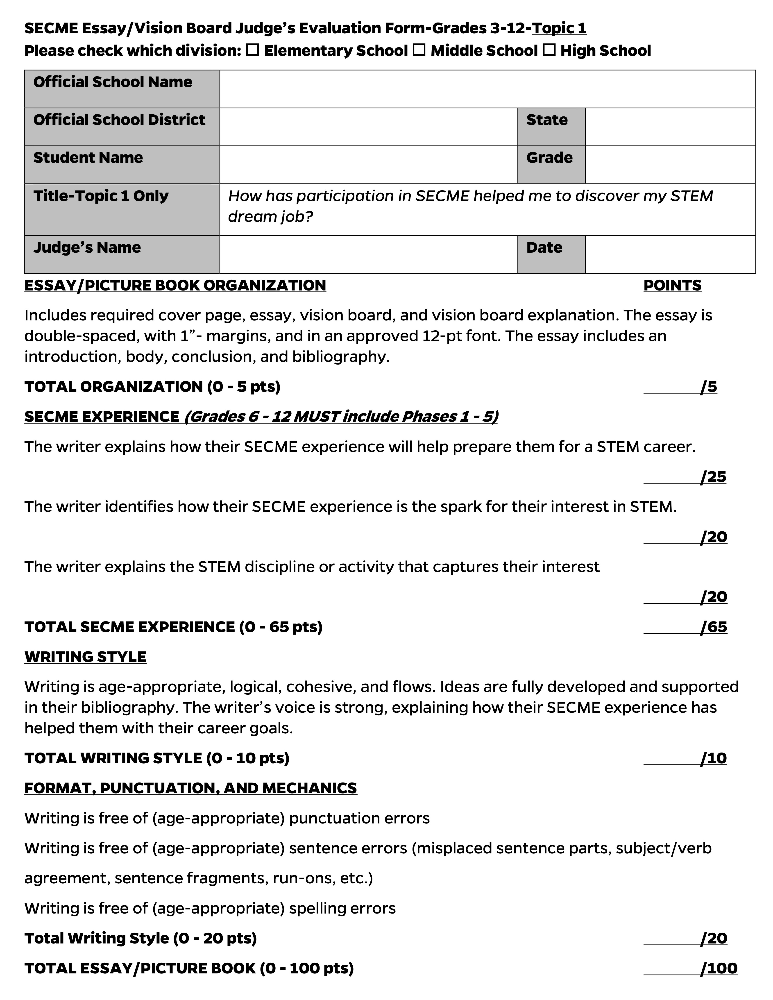{width=75%}
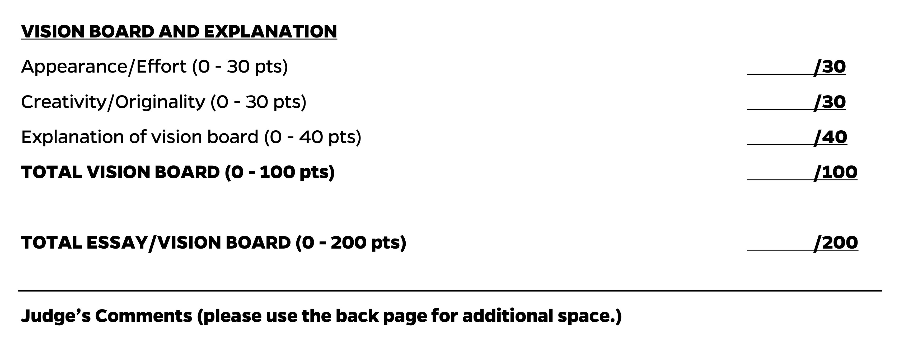{width=75%}
</center>


#### Topics 2-3

```{r echo=FALSE}
xfun::embed_file("/Users/kristadulany/Documents/GitHub/SECME/SECME Guidlines_22-23/docs/Essay_Vision Board_Judge Eval_3-12_T2-3.pdf")
```
<center>
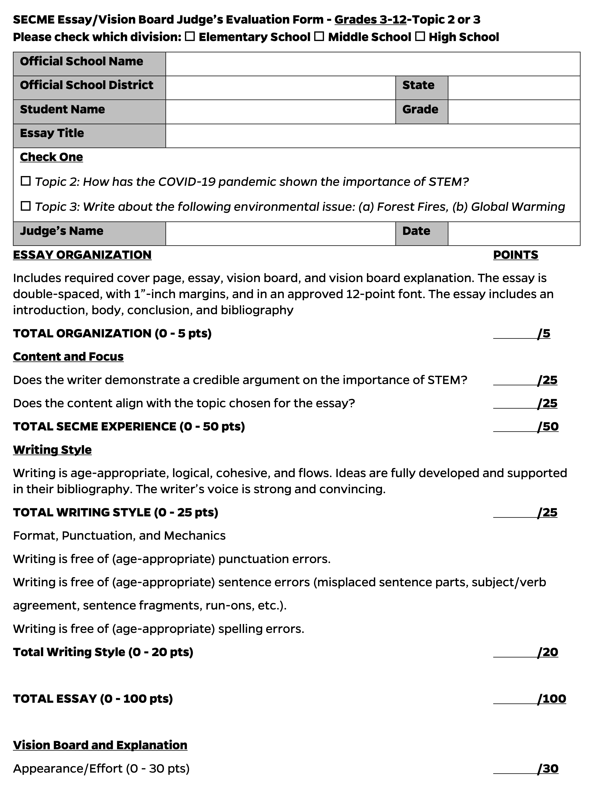{width=75%}
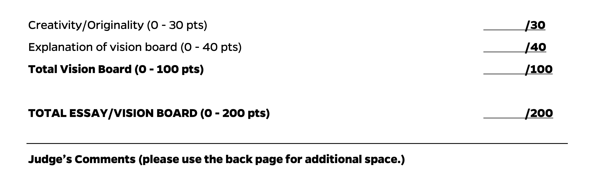{width=75%}
</center>

# Frequently Asked Questions (FAQs)

If you have any questions or need help in these specific areas, please contact:

**Engineering Design (Mousetrap Car)**: Contact the Member University engineering representative who sponsors your Regional/State competition.

**Engineering Design (Water Bottle Rocketry)**: Contact the Member University engineering representative who sponsors your Regional/State competition.

**VEX V5/VEX IQ Robotics**: Contact the SECME National Office - secme@eng.ufl.edu

**Essay/Vision Board, Picture Book, and Poster Competitions**: Contact the SECME National Office - secme@eng.ufl.edu


1. What if my winning school is not listed in the drop-down option?

    Only registered schools for the 2022-2023 school year will populate. Please select “not     listed” and type in the Official School Name if     the school’s name is not listed. We will follow up with that school.

2. We are a registered school but do not have a Regional Competition scheduled for this year. Can we participate in the SECME National Competition activities?

    Yes! Please contact Dr. Julaunica Tigner, SECME Outreach Coordinator, at julaunicatigner@ufl.edu for competition details.

3. Can we purchase mousetrap kits from the SECME National Office?

    No, SECME no longer sells mousetrap kits. Instead, SECME has adopted and encouraged scratch-build designs to foster more creativity and innovation. SECME Coordinators/ISLs can purchase mousetrap car kits at the following websites: 
    
    a. [Pitsco](https://www.pitsco.com/SearchAll/?keywords=mousetrap_car_kit&type=0)
    b. [Midwest Supply Company](https://www.midwesttechnology.com/midwest-products-mousetrap-racer-kits-12/)
    c. [DOC FIZZIX](https://www.docfizzix.com/)
    d. [Kelvin Educational](https://kelvin.com/search.php?search_query=mousetrap+car+kit)
    e. [Sciencekit.com](https://sciencekitstore.com/mousetrap-car/)

4. Where can we purchase bulk two-liter plastic bottles?

    [Pitsco](https://www.pitsco.com/SearchAll/?keywords=mousetrap_car_kit&type=0) or your local recycling facility
	
5. Where can we purchase the tennis balls? Please find one suggested supplier below:

    [Amazon (Pack of 3 Tennis Balls)-$6.99 as of 08/31/2022](https://www.amazon.com/Wilson-Minions-Stage-Tennis-Balls/dp/B08SMLGTFS/ref=sr_1_3?crid=1JD4VRLXCI4EA&keywords=tennis%2Bballs&qid=1661976476&refinements=p_89%3AWILSON&rnid=2528832011&s=sporting-goods&sprefix=tennis%2Caps%2C263&sr=1-3&th=1)

6. Where can we purchase the engineering paper?
    
    [ArtSupply.Com (10-sheets for $18.26 as of 08/31/2022)](https://www.artsupply.com/Clearprint-Vellum-17-X-22-10-Sheet-Pack_p_45604.html)

7. How does my SECME team determine the cost of 3D printing? 

    For 3D printing, the SECME student team evaluates the cost of the material used to make the part for their vehicle. 

    Example: Polylactic acid (PLA) pellets can be purchased for the price of $10.00 per 1 kg. If the SECME student team only used 1 g, the following calculation they would need to do to determine the cost of their 3D component:

    <center>
$\frac{10.00}{1 kg}×1 g×\frac{1 kg}{1000 g}=0.01$
    Cost = $0.01
    </center>

    The following is a link to how much 3D materials will cost in 2020:
    
    https://all3dp.com/2/how-much-do-3d-printer-materials-cost/

8. How does my SECME team log their purchases on their material list?

    Example: Balloons were purchased for $10.99 for 100 balloons. If the SECME student team only used two balloons, the following will be the calculation they would need to do to determine the cost:
    
    <center>
    $\frac{10.99}{100 ballons}×2 balloons=0.22$ 

    $0.22 for two balloons
    </center>

    An example of how to fill out the material list.
    <center>
    {width=75%}
    </center>
    
9. Local, District, State, or Regional SECME Competition Concerns and Complaints

    Please complete and submit the SECME Competition Grievance Form to the local, district, state, or regional SECME Competition Host. The local, district, state, or regional SECME Competition Host should handle all grievances at the local, district, state, or regional levels. 
    
*Note: Please follow any additional instructions or procedures your local, district, state, or regional SECME Competition Host implements.*
